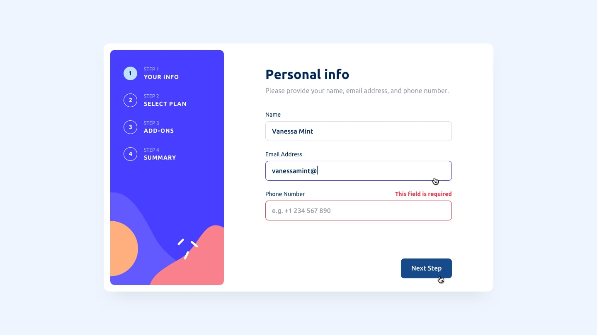

# 📝 Multi-step Form

This is a solution to the [Multi-step form challenge on Frontend Mentor](https://www.frontendmentor.io/challenges/multistep-form-YVAnSdqQBJ).  
It helped me enhance my skills in **React**, **form handling**, **conditional rendering**, and **responsive design**.

---

## Table of Contents

- [Overview](#overview)  
  - [Features](#features)  
  - [Screenshots](#screenshots)  
  - [Live Links](#live-links)  
  - [Built With](#built-with)  
- [Author](#author)  

---

## Overview

A dynamic multi-step form that guides users through a sequential process to collect information, review their choices, and confirm their order.

---

### Features

✅ Progress indicators and smooth step transitions  
✅ Validation for empty fields and email format  
✅ Ability to go back to previous steps to edit selections  
✅ Summary step for review before final submission  
✅ Mobile-first responsive layout  

---

### Screenshots

  
  
  

  
  
  
  
  

---

### Live Links

- 📁 GitHub Repository: [Multi-step Form App](https://github.com/vedantagrawal524/multi-step-form)  
- 🌐 Live Site: [https://multi-step-form524.vercel.app/](https://multi-step-form524.vercel.app/)

---

### Built With

- HTML5  
- Tailwind CSS  
- JavaScript  
- React  
- Form validation  
- Responsive design principles  
- Vercel (deployment)

---

## Author

- Portfolio – _Vedant Agrawal_  
- Frontend Mentor – [@vedantagrawal524](https://www.frontendmentor.io/profile/vedantagrawal524)  
- GitHub – [@vedantagrawal524](https://github.com/vedantagrawal524)

---

🧠 _Fueled by curiosity, completed with precision. Feedback and contributions are always welcome!_
